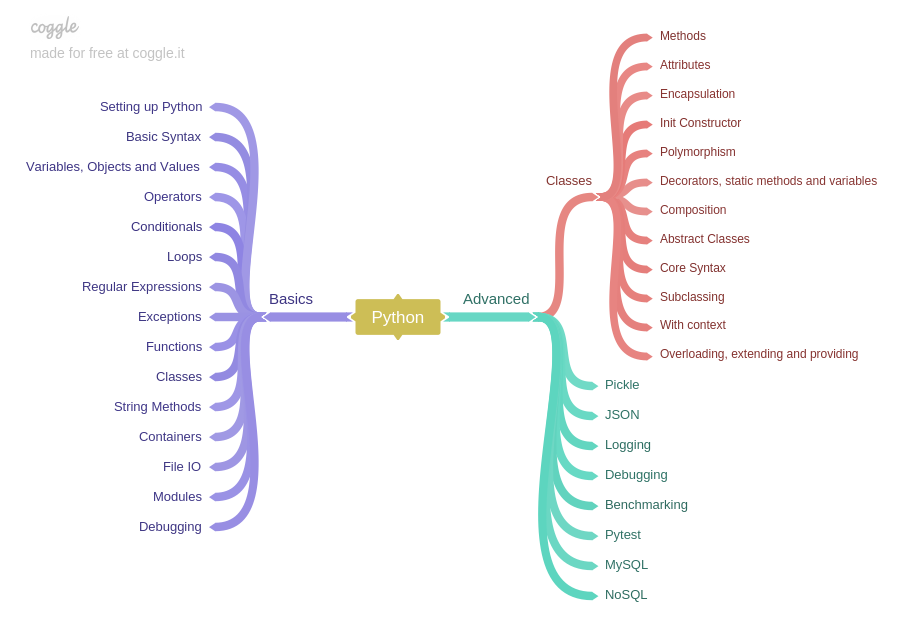

### Intro
If you're still learning python like me here's I guide to learning python made by a beginner for beginners.

### Mindmap / Roadmap
Here's a mindmap I made this are all the topics I will be learning to get a good grasp of python and be awesome at it. You can view it on [coggle.it](https://coggle.it/diagram/Wk6pMRImdAABAXL9/t/-) too.

### Preparation
Before you start learning python, I recommend you to create a repository so you can put all the scripts you made for later use. It'll make your github profile look good too. 

### Basics
We'll learn all the basics of python by watching free courses on youtube. I recommend watching this [playlist](https://www.youtube.com/watch?v=nwjAHQERL08&list=PLGLfVvz_LVvTn3cK5e6LjhgGiSeVlIRwt) on Youtube by Derek Banas. It covers most of the basic topics in python. There are assignments he will be asking you to do so don't forget to put all your scripts to your repository. The course has 26 episodes.

- [ ] Watch all videos.
- [ ] Do all assignments.
- [ ] Create a simple project. 

Follow him on [twitter](https://twitter.com/NewThinkTnank) and subscribe to his [channel](https://www.youtube.com/user/derekbanas) more content and awesome tutorials.

### Author
Follow me on twitter [@thepiratedv](https://twitter.com/thepiratedev) for more updates.

Share the love, leave a star.

